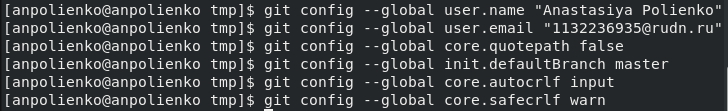

---
## Front matter
lang: ru-RU
title: Лабораторная работа №1
subtitle: Научное программирование
author:
  - Полиенко Анастасия Николаевна
institute:
  - Российский университет дружбы народов, Москва, Россия
  - НПМмд-02-23
date: 19 сентября 2023

## i18n babel
babel-lang: russian
babel-otherlangs: english

## Fonts
mainfont: PT Serif
romanfont: PT Serif
sansfont: PT Sans
monofont: PT Mono
mainfontoptions: Ligatures=TeX
romanfontoptions: Ligatures=TeX
sansfontoptions: Ligatures=TeX,Scale=MatchLowercase
monofontoptions: Scale=MatchLowercase,Scale=0.9

## Formatting pdf
toc: false
toc-title: Содержание
slide_level: 2
aspectratio: 169
section-titles: true
theme: metropolis
header-includes:
 - \metroset{progressbar=frametitle,sectionpage=progressbar,numbering=fraction}
 - '\makeatletter'
 - '\beamer@ignorenonframefalse'
 - '\makeatother'
---

# Управление версиями

## Цель лабораторной работы

1. Изучить идеологию и применение средств контроля версий.
1. Освоить умения по работе с git.
1. Изучить язык разметки Markdown.

## Задачи лабораторной работы

1. Создать базовую конфигурацию для работы с git.
1. Создать ключ SSH.
1. Создать ключ PGP.
1. Настроить подписи git.
1. Зарегистрироваться на Github.
1. Создать локальный каталог для выполнения заданий по предмету.
1. Создать отчёт по лабораторной работе, используя язык разметки Markdown.

# Ход лабораторной работы

## Установка нужных ресурсов

Устанавливаем git-flow и gh.

## Базовая настройка

Создаём базовую конфигурацию для работы с git и настраиваем автоматические подписи коммитов git.

## Ключи

Создаём ключи SSH по алгоритму rsa и алгоритму ed25519 и ключ PGP.

## Создание репозитория

Создадим репозиторий курса на основе шаблона для работы.

## Выводы

1. Изучила идеологию и применение средств контроля версий.
2. Освоила умения по работе с git.

