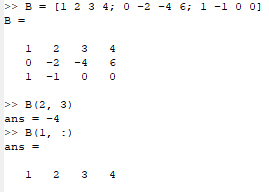
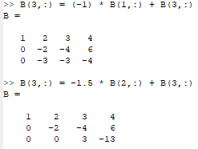
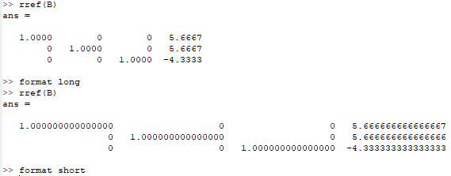
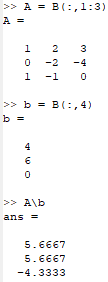
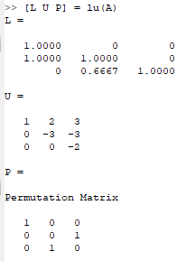

---
## Front matter
lang: ru-RU
title: Лабораторная работа №4
subtitle: Научное программирование
author:
  - Полиенко Анастасия Николаевна
institute:
  - Российский университет дружбы народов, Москва, Россия
  - НПМмд-02-23
date: 19 сентября 2023

## i18n babel
babel-lang: russian
babel-otherlangs: english

## Fonts
mainfont: PT Serif
romanfont: PT Serif
sansfont: PT Sans
monofont: PT Mono
mainfontoptions: Ligatures=TeX
romanfontoptions: Ligatures=TeX
sansfontoptions: Ligatures=TeX,Scale=MatchLowercase
monofontoptions: Scale=MatchLowercase,Scale=0.9

## Formatting pdf
toc: false
toc-title: Содержание
slide_level: 2
aspectratio: 169
section-titles: true
theme: metropolis
header-includes:
 - \metroset{progressbar=frametitle,sectionpage=progressbar,numbering=fraction}
 - '\makeatletter'
 - '\beamer@ignorenonframefalse'
 - '\makeatother'
---

# Системы линейных уравнений

## Цель лабораторной работы

Изучить работу с системами линейных уравнений в GNU Octave.

## Задачи лабораторной работы

1. Изучить метод Гаусса
1. Изучить метод левого деления
1. Изучить LUP-разложение

# Ход лабораторной работы

## Расширенная матрица

Для того, чтобы задать СЛАУ, необходимо задать расширенную матрицу *B*.

## Метод Гаусса

Реализуем метод Гаусса, поэтапно складывая строки матрицы *B*.

## Форматы вывода

Выведем получившуюся верхнюю треугольную матрицу в коротком и длинном формате.

## Метод левого деления

Реализуем метод левого деления, разбив расширенную матрицу *B* на квадратную матрицу *A* и вектор-столбец *b*.

## LUP-разложение

Реализуем LUP-разложение матрицы *A*.

## Выводы

Научилась работе с системами линейных алгебраических уравнений в Octave.

