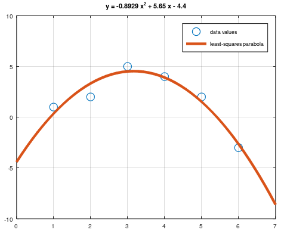
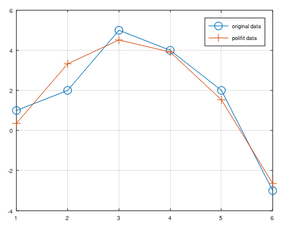
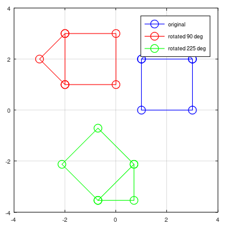
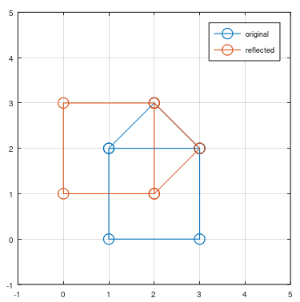
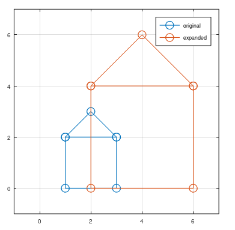

---
## Front matter
lang: ru-RU
title: Лабораторная работа №4
subtitle: Научное программирование
author:
  - Полиенко Анастасия Николаевна
institute:
  - Российский университет дружбы народов, Москва, Россия
  - НПМмд-02-23
date: 19 сентября 2023

## i18n babel
babel-lang: russian
babel-otherlangs: english

## Fonts
mainfont: PT Serif
romanfont: PT Serif
sansfont: PT Sans
monofont: PT Mono
mainfontoptions: Ligatures=TeX
romanfontoptions: Ligatures=TeX
sansfontoptions: Ligatures=TeX,Scale=MatchLowercase
monofontoptions: Scale=MatchLowercase,Scale=0.9

## Formatting pdf
toc: false
toc-title: Содержание
slide_level: 2
aspectratio: 169
section-titles: true
theme: metropolis
header-includes:
 - \metroset{progressbar=frametitle,sectionpage=progressbar,numbering=fraction}
 - '\makeatletter'
 - '\beamer@ignorenonframefalse'
 - '\makeatother'
---

# Матричные преобразования

## Цель лабораторной работы

Изучить матричные преобразования для графиков.

## Задачи лабораторной работы

1. Изучить подгонку полиномиальной кривой с помощью МНК
1. Изучить построение графов
1. Изучить повороты изображения
1. Изучить отображения изображения
1. Изучить дилатацию изображения

# Ход лабораторной работы

## Подгонка полиномиальной прямой 

Мы хотим подогнать наши данные под кривую $y = a_1 x^2 + a_2 x + a_3$.

## Метод Polyfit

Для построения полиномальной кривой можно использовать встроенный метод *polyfit*. В результате получаем такой график

## Вращение

## Отражение

## Дилатация

## Выводы

Изучила подгонку полиномиальной прямой и матричные преобразования в Octave.

