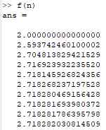
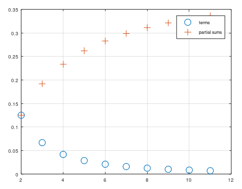
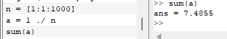
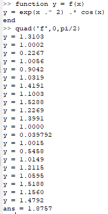
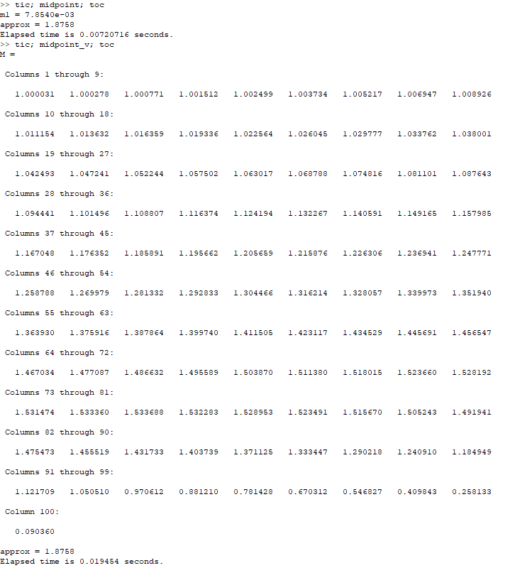

---
## Front matter
lang: ru-RU
title: Лабораторная работа №6
subtitle: Научное программирование
author:
  - Полиенко Анастасия Николаевна
institute:
  - Российский университет дружбы народов, Москва, Россия
  - НПМмд-02-23
date: 19 сентября 2023

## i18n babel
babel-lang: russian
babel-otherlangs: english

## Fonts
mainfont: PT Serif
romanfont: PT Serif
sansfont: PT Sans
monofont: PT Mono
mainfontoptions: Ligatures=TeX
romanfontoptions: Ligatures=TeX
sansfontoptions: Ligatures=TeX,Scale=MatchLowercase
monofontoptions: Scale=MatchLowercase,Scale=0.9

## Formatting pdf
toc: false
toc-title: Содержание
slide_level: 2
aspectratio: 169
section-titles: true
theme: metropolis
header-includes:
 - \metroset{progressbar=frametitle,sectionpage=progressbar,numbering=fraction}
 - '\makeatletter'
 - '\beamer@ignorenonframefalse'
 - '\makeatother'
---

# Пределы, последовательности и ряды и Численное интегрирование

## Цель лабораторной работы

Изучить работу с пределами, последовательностями и рядами и численным интегрированием в GNU Octave.

## Задачи лабораторной работы

1. Изучить работу с пределами, последовательностями и рядами
1. Изучить численное интегрирование

# Ход лабораторной работы

## Предел функции

Посчитаем значения функции $f(n)$. Можем наблюдать, как они сходятся к числу $e$.

## Частичные суммы

## Сумма ряда

Создаём индексную переменную, генерируем на основе неё вектор значений и считаем их сумму.

## Численное интегрирование

Создадим функцию и вычислим определённый интеграл с помощью всроенной команды quad.

## Аппроксимация суммами

Напишем код для аппроксимированния суммами с циклами и векторами и сравним два алгоритма по времени 

## Выводы

Научилась работе с системами линейных алгебраических уравнений в Octave.

