---
## Front matter
title: "Отчёт по лабораторной работе №6"
subtitle: "Дисциплина: Научное программирование"
author: "Полиенко Анастасия Николаевна, НПМмд-02-23"

## Generic otions
lang: ru-RU
toc-title: "Содержание"

## Bibliography
bibliography: bib/cite.bib
csl: pandoc/csl/gost-r-7-0-5-2008-numeric.csl

## Pdf output format
toc: true # Table of contents
toc-depth: 2
lof: true # List of figures
#lot: true # List of tables
fontsize: 12pt
linestretch: 1.5
papersize: a4
documentclass: scrreprt
## I18n polyglossia
polyglossia-lang:
  name: russian
  options:
	- spelling=modern
	- babelshorthands=true
polyglossia-otherlangs:
  name: english
## I18n babel
babel-lang: russian
babel-otherlangs: english
## Fonts
mainfont: PT Serif
romanfont: PT Serif
sansfont: PT Sans
monofont: PT Mono
mainfontoptions: Ligatures=TeX
romanfontoptions: Ligatures=TeX
sansfontoptions: Ligatures=TeX,Scale=MatchLowercase
monofontoptions: Scale=MatchLowercase,Scale=0.9
## Biblatex
biblatex: true
biblio-style: "gost-numeric"
biblatexoptions:
  - parentracker=true
  - backend=biber
  - hyperref=auto
  - language=auto
  - autolang=other*
  - citestyle=gost-numeric
## Pandoc-crossref LaTeX customization
figureTitle: "Рис."
tableTitle: "Таблица"
listingTitle: "Листинг"
lofTitle: "Список иллюстраций"
lotTitle: "Список таблиц"
lolTitle: "Листинги"
## Misc options
indent: true
header-includes:
  - \usepackage{indentfirst}
  - \usepackage{float} # keep figures where there are in the text
  - \floatplacement{figure}{H} # keep figures where there are in the text
---

# Цель работы

Изучить работу с пределами, последовательностями и рядами и численным интегрированием в GNU Octave.

# Задание

1. Изучить работу с пределами, последовательностями и рядами
1. Изучить численное интегрирование

# Выполнение лабораторной работы

## Пределы, последовательности и ряды

1. Рассмотрим предел 

$$\lim\limits_{n \rightarrow \infty} \left( 1 + \frac{1}{n} \right)^n$$

Определим анонимную функцию (рис. @fig:001).

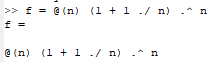{#fig:001 width=60%}

Создаём индексную переменную (рис. @fig:002).

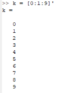{#fig:002 width=60%}

С помощью индексной переменной определим значения $n$ как степени 10 (рис. @fig:003).

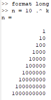{#fig:003 width=60%}

И посчитаем значения функции $f(n)$ (рис. @fig:004). Можем наблюдать, как они сходятся к числу $e$.

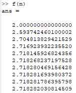{#fig:004 width=60%}

2. Посчитаем частичные суммы для ряда

$$\sum\limits_{n=2}^{\infty} a_n, \text{где} a_n = \frac{1}{n(n+2)}$$

Создаём индексную переменную и считаем члены ряда (рис. @fig:005).

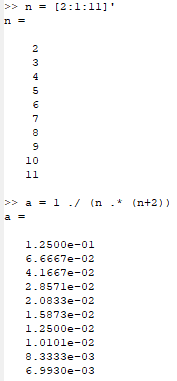{#fig:005 width=60%}

В цикле считаем последовательность частичных сумм (рис. @fig:006) и выведем их (рис. @fig:007).

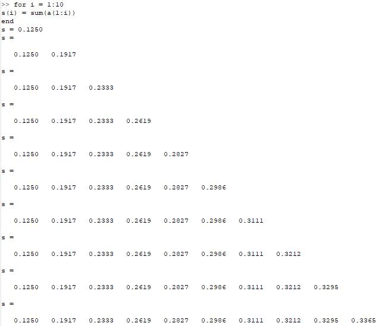{#fig:006 width=60%}

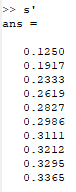{#fig:007 width=60%}

Выведем члены последовательности и частичные суммы на график (рис. @fig:008).

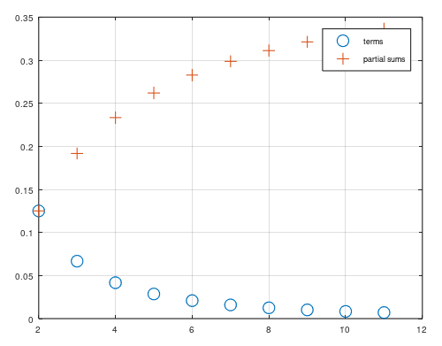{#fig:008 width=60%}

3. Посчитаем сумму ряда 

$$\sum\limits_{n=1}^{1000} \frac{1}{n}$$

Создаём индексную переменную, генерируем на основе неё вектор значений и считаем их сумму (рис. @fig:009).

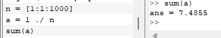{#fig:009 width=60%}

## Численное интегрирование

1. Создадим функцию и вычислим определённый интеграл с помощью всроенной команды quad (рис. @fig:010).

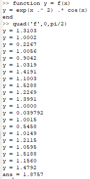{#fig:010 width=60%}

2. Напишем код для аппроксимированния суммами с циклами (рис. @fig:011) и выведем результат (рис. @fig:012); и векторами (рис. @fig:013) и выведем результат (рис. @fig:014). 

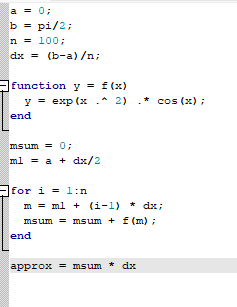{#fig:011 width=60%}

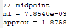{#fig:012 width=60%}

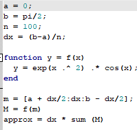{#fig:013 width=60%}

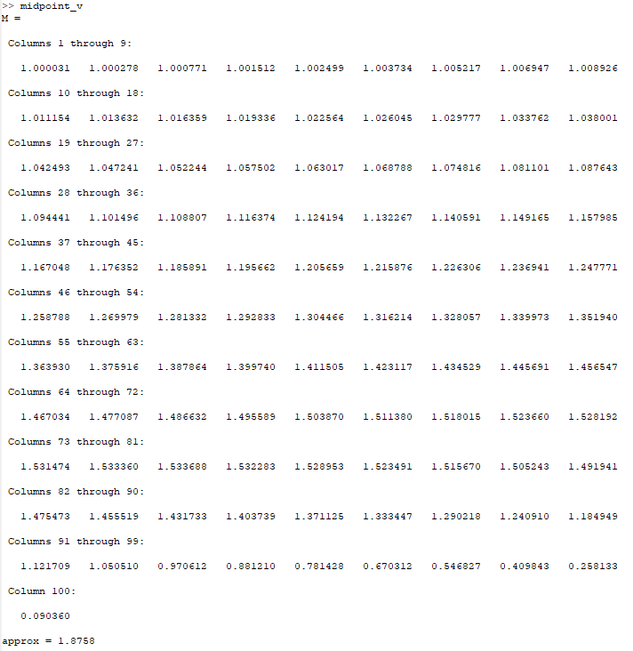{#fig:014 width=60%}

Сравним два алгоритма по времени (рис. @fig:015).

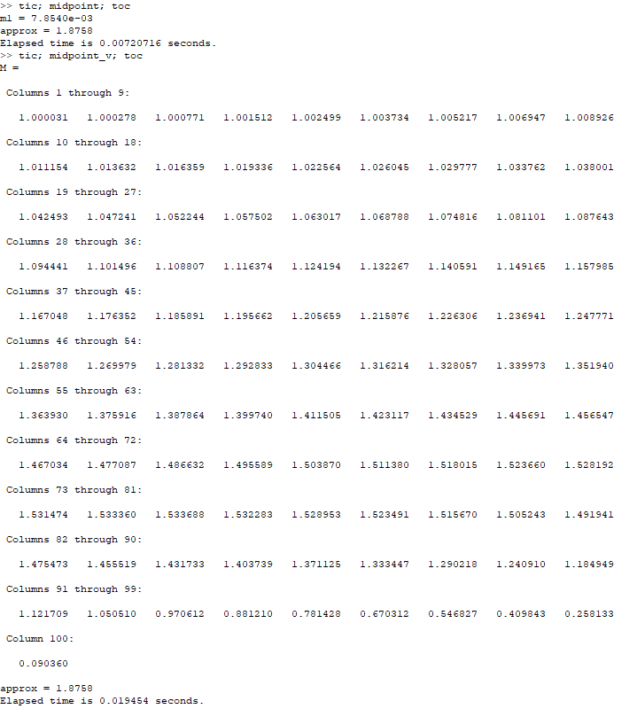{#fig:015 width=60%}

# Выводы

Научилась работе с системами линейных алгебраических уравнений в Octave.
