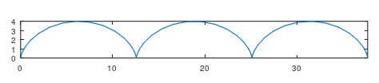
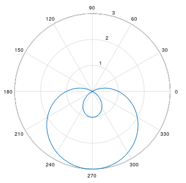
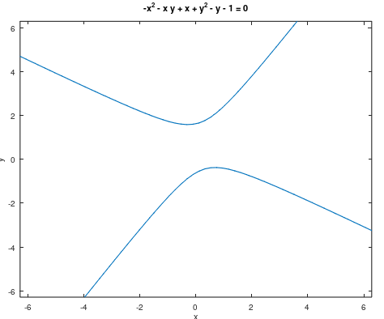
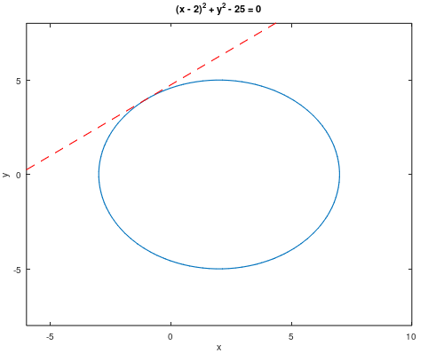
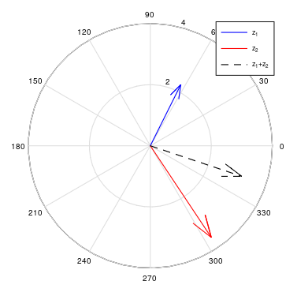
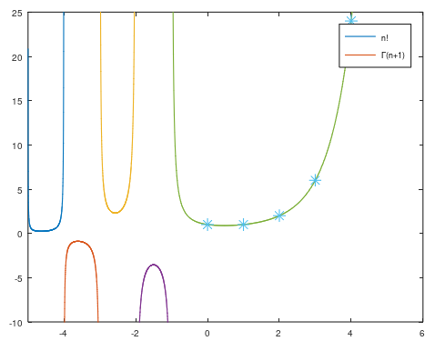

---
## Front matter
lang: ru-RU
title: Лабораторная работа №7
subtitle: Научное программирование
author:
  - Полиенко Анастасия Николаевна
institute:
  - Российский университет дружбы народов, Москва, Россия
  - НПМмд-02-23
date: 19 сентября 2023

## i18n babel
babel-lang: russian
babel-otherlangs: english

## Fonts
mainfont: PT Serif
romanfont: PT Serif
sansfont: PT Sans
monofont: PT Mono
mainfontoptions: Ligatures=TeX
romanfontoptions: Ligatures=TeX
sansfontoptions: Ligatures=TeX,Scale=MatchLowercase
monofontoptions: Scale=MatchLowercase,Scale=0.9

## Formatting pdf
toc: false
toc-title: Содержание
slide_level: 2
aspectratio: 169
section-titles: true
theme: metropolis
header-includes:
 - \metroset{progressbar=frametitle,sectionpage=progressbar,numbering=fraction}
 - '\makeatletter'
 - '\beamer@ignorenonframefalse'
 - '\makeatother'
---

# Графики функций

## Цель лабораторной работы

Изучить построение различных графиков в GNU Octave.

## Задачи лабораторной работы

Изучить параметрические и полярные графики, графики неявных функций и комплексных чисел.

# Ход лабораторной работы

## Параметрический график

## Полярный график

## График неявной функции

## Окружность и касательная

## Комплексные числа на графике

## Гамма-функция

## Выводы

Научилась работе с системами линейных алгебраических уравнений в Octave.

