---
## Front matter
title: "Отчёт по лабораторной работе №7"
subtitle: "Дисциплина: Научное программирование"
author: "Полиенко Анастасия Николаевна, НПМмд-02-23"

## Generic otions
lang: ru-RU
toc-title: "Содержание"

## Bibliography
bibliography: bib/cite.bib
csl: pandoc/csl/gost-r-7-0-5-2008-numeric.csl

## Pdf output format
toc: true # Table of contents
toc-depth: 2
lof: true # List of figures
#lot: true # List of tables
fontsize: 12pt
linestretch: 1.5
papersize: a4
documentclass: scrreprt
## I18n polyglossia
polyglossia-lang:
  name: russian
  options:
	- spelling=modern
	- babelshorthands=true
polyglossia-otherlangs:
  name: english
## I18n babel
babel-lang: russian
babel-otherlangs: english
## Fonts
mainfont: PT Serif
romanfont: PT Serif
sansfont: PT Sans
monofont: PT Mono
mainfontoptions: Ligatures=TeX
romanfontoptions: Ligatures=TeX
sansfontoptions: Ligatures=TeX,Scale=MatchLowercase
monofontoptions: Scale=MatchLowercase,Scale=0.9
## Biblatex
biblatex: true
biblio-style: "gost-numeric"
biblatexoptions:
  - parentracker=true
  - backend=biber
  - hyperref=auto
  - language=auto
  - autolang=other*
  - citestyle=gost-numeric
## Pandoc-crossref LaTeX customization
figureTitle: "Рис."
tableTitle: "Таблица"
listingTitle: "Листинг"
lofTitle: "Список иллюстраций"
lotTitle: "Список таблиц"
lolTitle: "Листинги"
## Misc options
indent: true
header-includes:
  - \usepackage{indentfirst}
  - \usepackage{float} # keep figures where there are in the text
  - \floatplacement{figure}{H} # keep figures where there are in the text
---

# Цель работы

Изучить построение различных графиков в GNU Octave.

# Задание

Изучить параметрические и полярные графики, графики неявных функций и комплексных чисел

# Выполнение лабораторной работы

1. Построим график для параметрического уравнения циклоиды (рис. @fig:001):

$$x = r(t - \sin (t)), \ y = r ($$

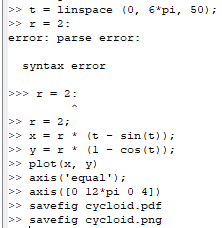{#fig:001 width=60%}

В итоге получаем следующий график (рис. @fig:002).

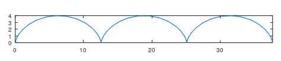{#fig:002 width=90%}

2. Построим улитку паскаля в декартовых (рис. @fig:003) и полярных координатах (рис. @fig:004).

$$r = 1 - 2 \sin (\theta)$$

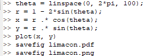{#fig:003 width=60%}

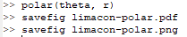{#fig:004 width=60%}

В итоге получаем следующие графики (рис. @fig:005-@fig:006).

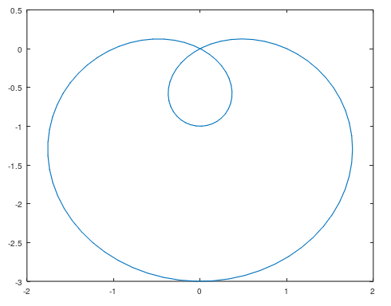{#fig:005 width=90%}

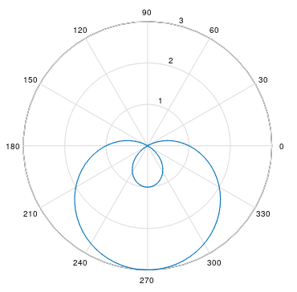{#fig:006 width=90%}

3. Построим график неявной функции (рис. @fig:007).

$$-x^2-xy+x+y^2-y=1$$

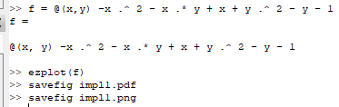{#fig:007 width=60%}

В результате получаем следующий график (рис. @fig:008).

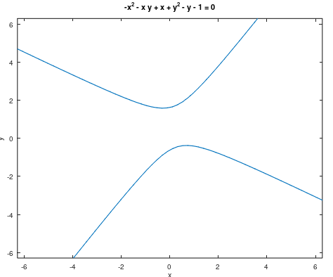{#fig:008 width=90%}

Построим график окружности и касательной к ней (рис. @fig:009). 

$$(x-2)^2+y^2=25$$

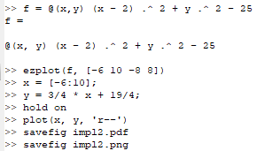{#fig:009 width=60%}

В результате получаем следующий график (рис. @fig:010).

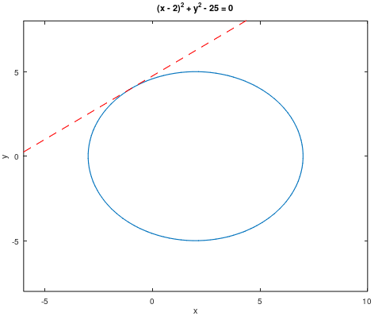{#fig:010 width=90%}

4. В GNU Octave можно работать с комплексными числами (рис. @fig:011). 

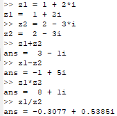{#fig:011 width=60%}

Также можно изображать их на графике (рис. @fig:012).

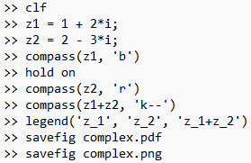{#fig:012 width=60%}

В результате получаем следующий график (рис. @fig:013).

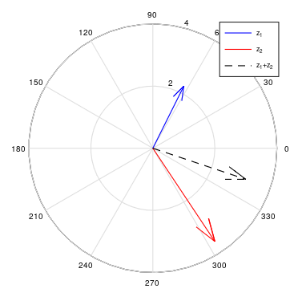{#fig:013 width=90%}

Имеются особенности при извлечении корней из комплексных чисел. Для получения действительных корней следует использовать функцию *nthroot* вместо дробной степени (рис. @fig:014).

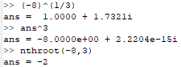{#fig:014 width=60%}

5. Построим график Гамма-функции и факториала (рис. @fig:015).

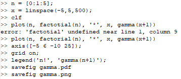{#fig:015 width=60%}

В результате получаем следующий график (рис. @fig:016).

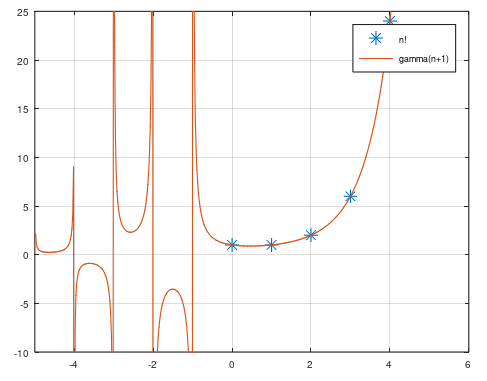{#fig:016 width=90%}

Чтобы избежать погрешностей вычесления в области ассимптот построим график на отдельных участках (рис. @fig:017).

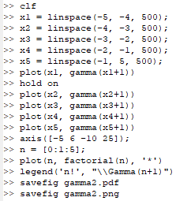{#fig:017 width=60%}

В результате получаем следующий график (рис. @fig:018).

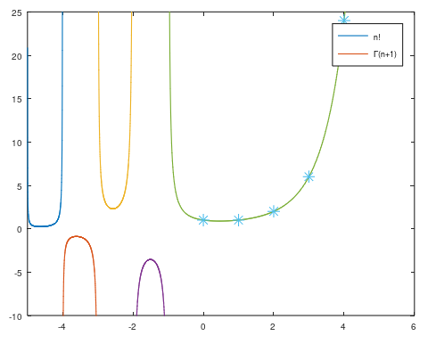{#fig:018 width=90%}

# Выводы

Научилась работе с графиками в Octave.
