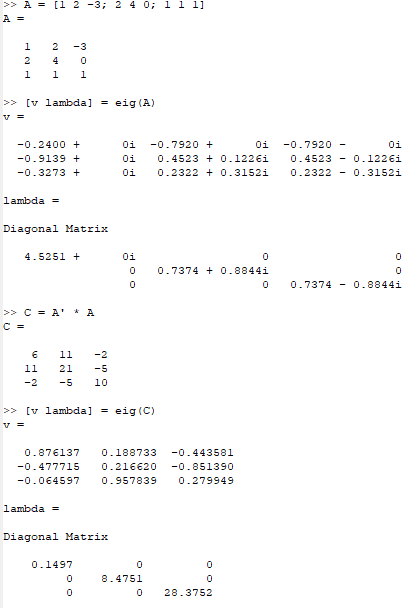
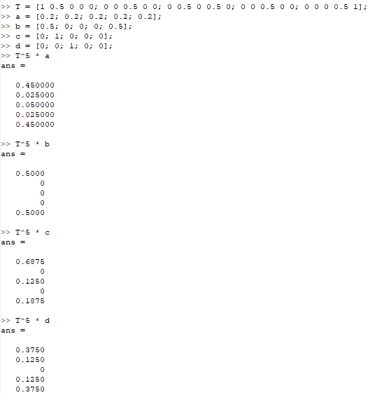
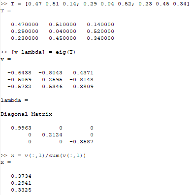

---
## Front matter
lang: ru-RU
title: Лабораторная работа №8
subtitle: Научное программирование
author:
  - Полиенко Анастасия Николаевна
institute:
  - Российский университет дружбы народов, Москва, Россия
  - НПМмд-02-23
date: 19 сентября 2023

## i18n babel
babel-lang: russian
babel-otherlangs: english

## Fonts
mainfont: PT Serif
romanfont: PT Serif
sansfont: PT Sans
monofont: PT Mono
mainfontoptions: Ligatures=TeX
romanfontoptions: Ligatures=TeX
sansfontoptions: Ligatures=TeX,Scale=MatchLowercase
monofontoptions: Scale=MatchLowercase,Scale=0.9

## Formatting pdf
toc: false
toc-title: Содержание
slide_level: 2
aspectratio: 169
section-titles: true
theme: metropolis
header-includes:
 - \metroset{progressbar=frametitle,sectionpage=progressbar,numbering=fraction}
 - '\makeatletter'
 - '\beamer@ignorenonframefalse'
 - '\makeatother'
---

# Задача на собственные значения

## Цель лабораторной работы

Изучить работу с собственными значениями в GNU Octave.

## Задачи лабораторной работы

1. Изучить задачу на собственные значения
1. Исследовать марковские цепи

# Ход лабораторной работы

## Нахождение собственных значений

Найдём собственные значения и собственные векторы для матриц с помощью функции *eig*.

## Марковская цепь

Найдём вектора вероятности через 5 шагов.

## Равновесный вектор

Найдём равновесный вектор для марковского процесса. 

## Выводы

Научилась работе со спектром матрицы в Octave.

