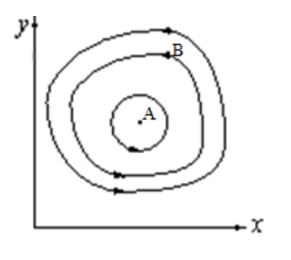

---
## Front matter
lang: ru-RU
title: Групповой проект №4. Этап №1
subtitle: Научное программирование
author:
  - Леонтьева К.А.
  - Минов К.В.
  - Назарьин А.И.
  - Полиенко А.Н.
institute:
  - НПМмд-02-23

## i18n babel
babel-lang: russian
babel-otherlangs: english

## Fonts
mainfont: PT Serif
romanfont: PT Serif
sansfont: PT Sans
monofont: PT Mono
mainfontoptions: Ligatures=TeX
romanfontoptions: Ligatures=TeX
sansfontoptions: Ligatures=TeX,Scale=MatchLowercase
monofontoptions: Scale=MatchLowercase,Scale=0.9

## Formatting pdf
toc: false
toc-title: Содержание
slide_level: 2
aspectratio: 169
section-titles: true
theme: metropolis
header-includes:
 - \metroset{progressbar=frametitle,sectionpage=progressbar,numbering=fraction}
 - '\makeatletter'
 - '\beamer@ignorenonframefalse'
 - '\makeatother'
---

# Модель Лотки-Вальтеры (модель "хищник-жертва")

## Предположения

1. Численность популяции жертв $x$ и хищников $y$ зависят только от времени (модель не учитывает пространственное распределение популяции на занимаемой территории)
1. В отсутствии взаимодействия численность видов изменяется по модели Мальтуса, при этом число жертв увеличивается, а число хищников падает
1. Естественная смертность жертвы и естественная рождаемость хищника считаются несущественными
1. Эффект насыщения численности обеих популяций не учитывается
1. Скорость роста численности жертв уменьшается пропорционально численности хищников

## Уравнения

$$\frac{dx}{dt}=ax(t)-bx(t)y(t)$$

$$\frac{dy}{dt}=-cy(t)+dx(t)y(t)$$

В этой модели $x$ – число жертв, $y$ - число хищников. Коэффициент $a$ описывает скорость естественного прироста числа жертв в отсутствие хищников, $с$ - естественное вымирание хищников, лишенных пищи в виде жертв. Вероятность взаимодействия жертвы и хищника считается пропорциональной как количеству жертв, так и числу самих хищников $(xy)$. Каждый акт взаимодействия уменьшает популяцию жертв, но способствует увеличению популяции хищников (члены $-bxy$ и $dxy$ в правой части уравнения).

## Стационарность

Имеется стационарное состояние A, всякое же другое начальное состояние B приводит к периодическому колебанию численности как жертв, так и хищников.

{width=50%}

# Постановка задачи

## Установка нужных ресурсов

В лесу проживают $х$ число волков, питающихся зайцами, число которых в этом же лесу $у$. Данная модель описывается следующим уравнением:

$$\frac{dx}{dt}=-ax(t)+bx(t)y(t)$$

$$\frac{dy}{dt}=cy(t)-dx(t)y(t)$$

$a$, $d$ - коэффициенты смертности

$b$, $c$ - коэффициенты прироста популяции

## Задание

1. Построить график зависимости $x$ от $y$ и графики функций $x(t), y(t)$
1. Найти стационарное состояние системы

## Выводы

Было дано теоретическое описание задачи и описание модели.

