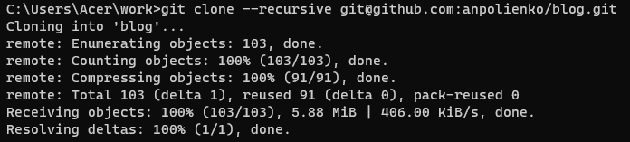
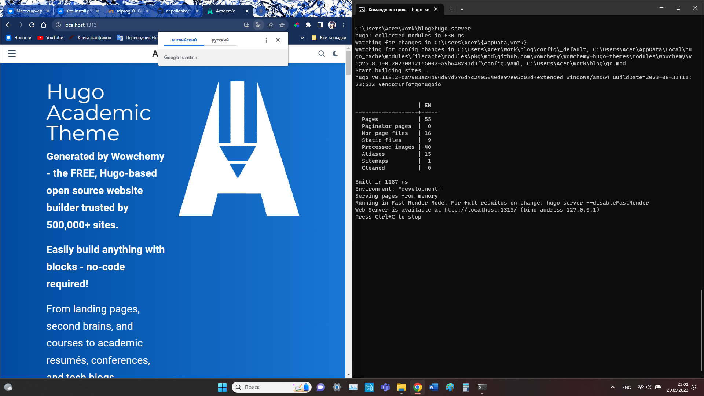
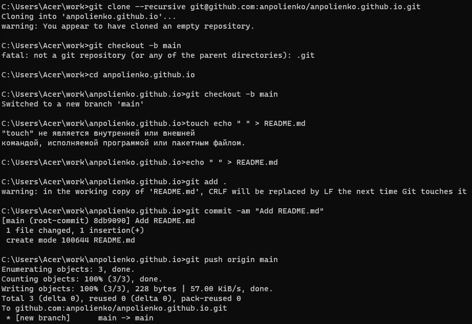
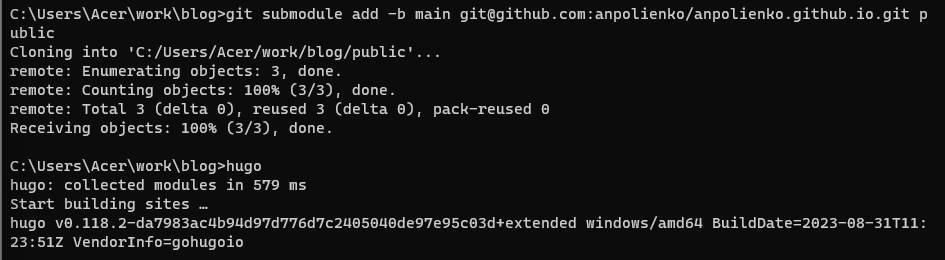
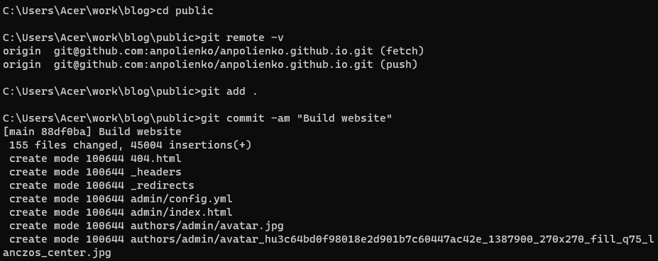

---
## Front matter
lang: ru-RU
title: Индивидуальный проект. Этап №1
subtitle: Научное программирование
author:
  - Полиенко Анастасия Николаевна
institute:
  - Российский университет дружбы народов, Москва, Россия
  - НПМмд-02-23
date: 20 сентября 2023

## i18n babel
babel-lang: russian
babel-otherlangs: english

## Fonts
mainfont: PT Serif
romanfont: PT Serif
sansfont: PT Sans
monofont: PT Mono
mainfontoptions: Ligatures=TeX
romanfontoptions: Ligatures=TeX
sansfontoptions: Ligatures=TeX,Scale=MatchLowercase
monofontoptions: Scale=MatchLowercase,Scale=0.9

## Formatting pdf
toc: false
toc-title: Содержание
slide_level: 2
aspectratio: 169
section-titles: true
theme: metropolis
header-includes:
 - \metroset{progressbar=frametitle,sectionpage=progressbar,numbering=fraction}
 - '\makeatletter'
 - '\beamer@ignorenonframefalse'
 - '\makeatother'
---

# Этап 1. Заготовка сайта

## Цель работы

Создание персонального научного сайта-визитки на основе системы управления статическими сайтами.

## Задание

Разместить на Github pages заготовки для персонального сайта.

# Ход работы

## Скачачивание шаблона

Создаём репозиторий *blog* на основе шаблона.

## Локальный сервер

Проверяем работу сайта на локальном сервере с помощью *hugo server*.

## Репозиторий anpolienko.github.io

Создаём репозиторий *anpolienko.github.io* для размещения сайта на хостинге.

## Папка public

Создаём подмодуль в папке public.

## Публичный сервер

1. Запускаем повторно hugo для создания сайта на публичном сервере.

## Выводы

Провела первый этап подготовки к созданию персонального научного сайта-визитки на основе системы управления статическими сайтами.

