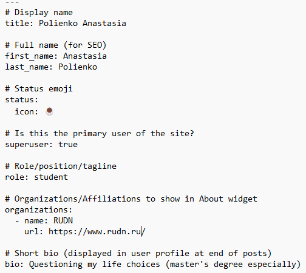
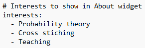
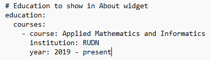
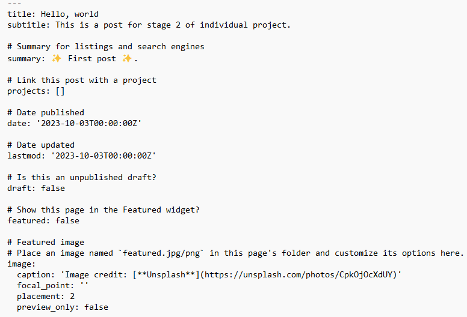
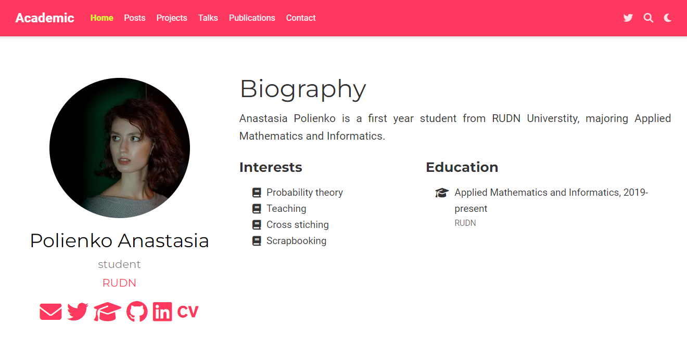

---
## Front matter
lang: ru-RU
title: Индивидуальный проект. Этап №2
subtitle: Научное программирование
author:
  - Полиенко Анастасия Николаевна
institute:
  - Российский университет дружбы народов, Москва, Россия
  - НПМмд-02-23
date: 20 сентября 2023

## i18n babel
babel-lang: russian
babel-otherlangs: english

## Fonts
mainfont: PT Serif
romanfont: PT Serif
sansfont: PT Sans
monofont: PT Mono
mainfontoptions: Ligatures=TeX
romanfontoptions: Ligatures=TeX
sansfontoptions: Ligatures=TeX,Scale=MatchLowercase
monofontoptions: Scale=MatchLowercase,Scale=0.9

## Formatting pdf
toc: false
toc-title: Содержание
slide_level: 2
aspectratio: 169
section-titles: true
theme: metropolis
header-includes:
 - \metroset{progressbar=frametitle,sectionpage=progressbar,numbering=fraction}
 - '\makeatletter'
 - '\beamer@ignorenonframefalse'
 - '\makeatother'
---

# Этап 2. Добавление личных данных

## Цель работы

Создание персонального научного сайта-визитки на основе системы управления статическими сайтами.

## Задание

Добавить информацию о себе на сайт.

# Ход работы

## Добавление личных данных

Для добавления личных данных на сайт редактируем файл *work/blog/content/authors/admin*.

Добавляем имя, университет и короткую подпись для окончания постов.

## Добавление личных данных

Добавляем интересы и информацию об образовании

## Создание постов

Создаём пост о прошедшей неделе

## Внешний вид сайта

После обновления данных сайт имеет вид.

## Выводы

Провела второй этап подготовки к созданию персонального научного сайта-визитки на основе системы управления статическими сайтами.

