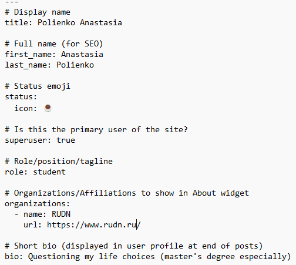
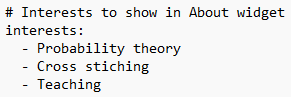
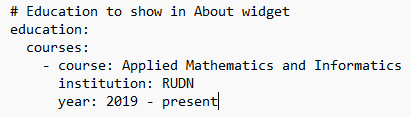
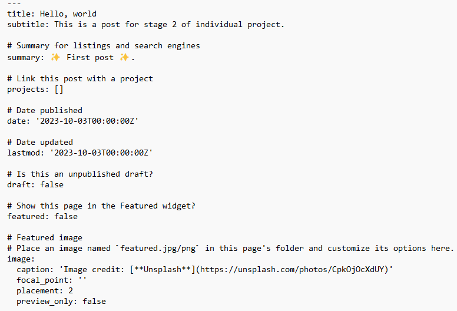
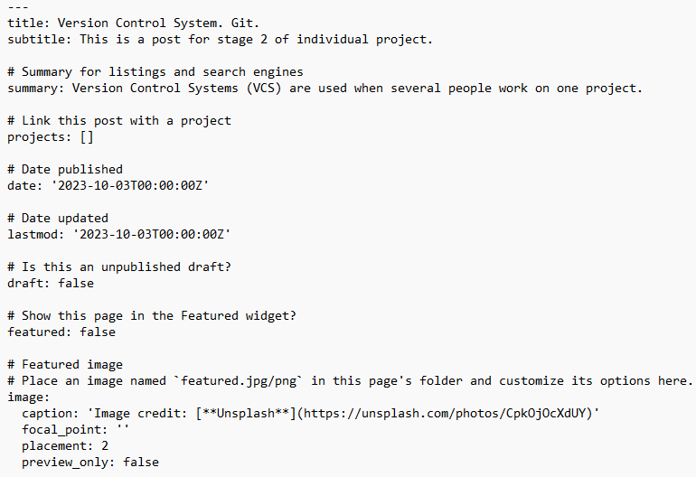
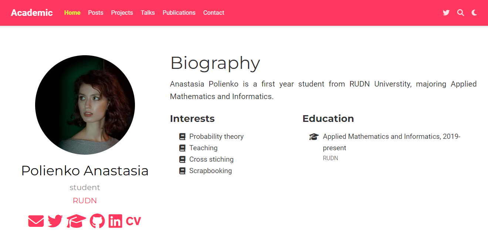
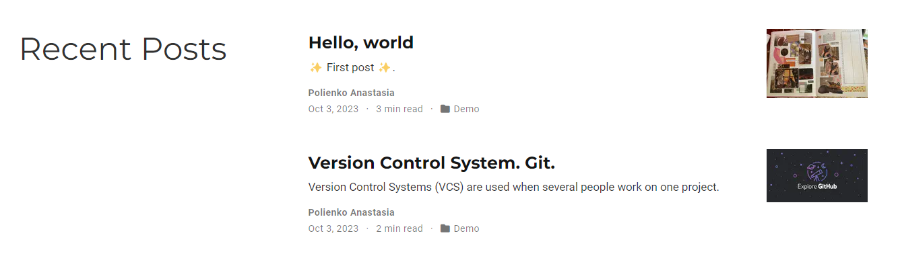

---
## Front matter
title: "Отчёт по индивидиуальному проекту. Этап №2"
subtitle: "Дисциплина: Научное программирование"
author: "Полиенко Анастасия Николаевна, НПМмд-02-23"

## Generic otions
lang: ru-RU
toc-title: "Содержание"

## Bibliography
bibliography: bib/cite.bib
csl: pandoc/csl/gost-r-7-0-5-2008-numeric.csl

## Pdf output format
toc: true # Table of contents
toc-depth: 2
lof: true # List of figures
#lot: true # List of tables
fontsize: 12pt
linestretch: 1.5
papersize: a4
documentclass: scrreprt
## I18n polyglossia
polyglossia-lang:
  name: russian
  options:
	- spelling=modern
	- babelshorthands=true
polyglossia-otherlangs:
  name: english
## I18n babel
babel-lang: russian
babel-otherlangs: english
## Fonts
mainfont: PT Serif
romanfont: PT Serif
sansfont: PT Sans
monofont: PT Mono
mainfontoptions: Ligatures=TeX
romanfontoptions: Ligatures=TeX
sansfontoptions: Ligatures=TeX,Scale=MatchLowercase
monofontoptions: Scale=MatchLowercase,Scale=0.9
## Biblatex
biblatex: true
biblio-style: "gost-numeric"
biblatexoptions:
  - parentracker=true
  - backend=biber
  - hyperref=auto
  - language=auto
  - autolang=other*
  - citestyle=gost-numeric
## Pandoc-crossref LaTeX customization
figureTitle: "Рис."
tableTitle: "Таблица"
listingTitle: "Листинг"
lofTitle: "Список иллюстраций"
lotTitle: "Список таблиц"
lolTitle: "Листинги"
## Misc options
indent: true
header-includes:
  - \usepackage{indentfirst}
  - \usepackage{float} # keep figures where there are in the text
  - \floatplacement{figure}{H} # keep figures where there are in the text
---

# Цель работы

Создание персонального научного сайта-визитки на основе системы управления статическими сайтами.

# Задание

Добавить к сайту данные о себе:

1. Разместить фотографию владельца сайта.
1. Разместить краткое описание владельца сайта (Biography).
1. Добавить информацию об интересах (Interests).
1. Добавить информацию от образовании (Education).

Сделать пост по прошедшей неделе.

Добавить пост на тему по выбору:

1. Управление версиями. Git.
1. Непрерывная интеграция и непрерывное развертывание (CI/CD).

# Ход работы

Для добавления личных данных на сайт редактируем файл *work/blog/content/authors/admin*.

Добавляем имя, университет и короткую подпись для окончания постов (рис. @fig:001)

{#fig:001 width=70%}

Добавляем интересы (рис. @fig:002)

{#fig:002 width=70%}

Добавляем информацию об образовании (рис. @fig:003)

{#fig:003 width=70%}

Создаём пост о прошедшей неделе (рис. @fig:004)

{#fig:004 width=70%}

И пост по теме "Управление версиями. Git." (рис. @fig:005)

{#fig:005 width=70%}

После обновления данных сайт имеет вид (рис. @fig:006, @fig:007)

{#fig:006 width=70%}

{#fig:007 width=70%}

# Выводы

Провела второй этап подготовки к созданию персонального научного сайта-визитки на основе системы управления статическими сайтами.
