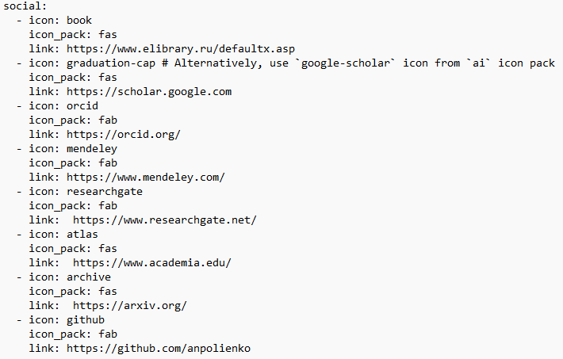
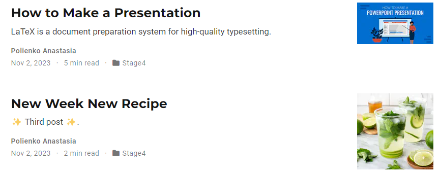

---
## Front matter
title: "Отчёт по индивидиуальному проекту. Этап №4"
subtitle: "Дисциплина: Научное программирование"
author: "Полиенко Анастасия Николаевна, НПМмд-02-23"

## Generic otions
lang: ru-RU
toc-title: "Содержание"

## Bibliography
bibliography: bib/cite.bib
csl: pandoc/csl/gost-r-7-0-5-2008-numeric.csl

## Pdf output format
toc: true # Table of contents
toc-depth: 2
lof: true # List of figures
#lot: true # List of tables
fontsize: 12pt
linestretch: 1.5
papersize: a4
documentclass: scrreprt
## I18n polyglossia
polyglossia-lang:
  name: russian
  options:
	- spelling=modern
	- babelshorthands=true
polyglossia-otherlangs:
  name: english
## I18n babel
babel-lang: russian
babel-otherlangs: english
## Fonts
mainfont: PT Serif
romanfont: PT Serif
sansfont: PT Sans
monofont: PT Mono
mainfontoptions: Ligatures=TeX
romanfontoptions: Ligatures=TeX
sansfontoptions: Ligatures=TeX,Scale=MatchLowercase
monofontoptions: Scale=MatchLowercase,Scale=0.9
## Biblatex
biblatex: true
biblio-style: "gost-numeric"
biblatexoptions:
  - parentracker=true
  - backend=biber
  - hyperref=auto
  - language=auto
  - autolang=other*
  - citestyle=gost-numeric
## Pandoc-crossref LaTeX customization
figureTitle: "Рис."
tableTitle: "Таблица"
listingTitle: "Листинг"
lofTitle: "Список иллюстраций"
lotTitle: "Список таблиц"
lolTitle: "Листинги"
## Misc options
indent: true
header-includes:
  - \usepackage{indentfirst}
  - \usepackage{float} # keep figures where there are in the text
  - \floatplacement{figure}{H} # keep figures where there are in the text
---

# Цель работы

Создание персонального научного сайта-визитки на основе системы управления статическими сайтами.

# Задание

Зарегистрироваться на соответствующих ресурсах и разместить на них ссылки на сайте:

1. eLibrary : https://elibrary.ru/;
1. Google Scholar : https://scholar.google.com/;
1. ORCID : https://orcid.org/;
1. Mendeley : https://www.mendeley.com/;
1. ResearchGate : https://www.researchgate.net/;
1. Academia.edu : https://www.academia.edu/;
1. arXiv : https://arxiv.org/;
1. github : https://github.com/.

Сделать пост по прошедшей неделе.

Добавить пост на тему по выбору:

1. Оформление отчёта.
1. Создание презентаций.
1. Работа с библиографией.

# Ход работы

Для добавления ссылок на различные ресурсы редактируем файл *work/blog/content/authors/_index.md* (рис. @fig:001)

{#fig:001 width=70%}

Создаём пост о прошедшей неделе и пост по теме "Создание презентаций" (рис. @fig:002)

{#fig:002 width=70%}

# Выводы

Провела четвёртый этап подготовки к созданию персонального научного сайта-визитки на основе системы управления статическими сайтами.
