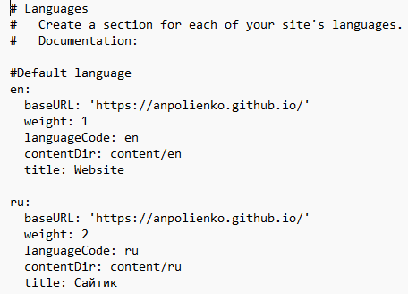
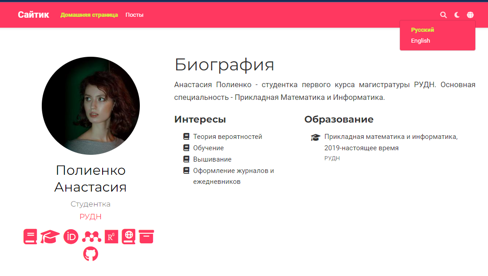
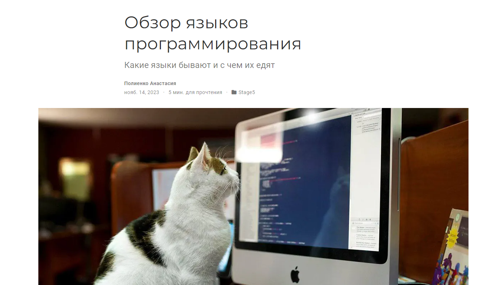
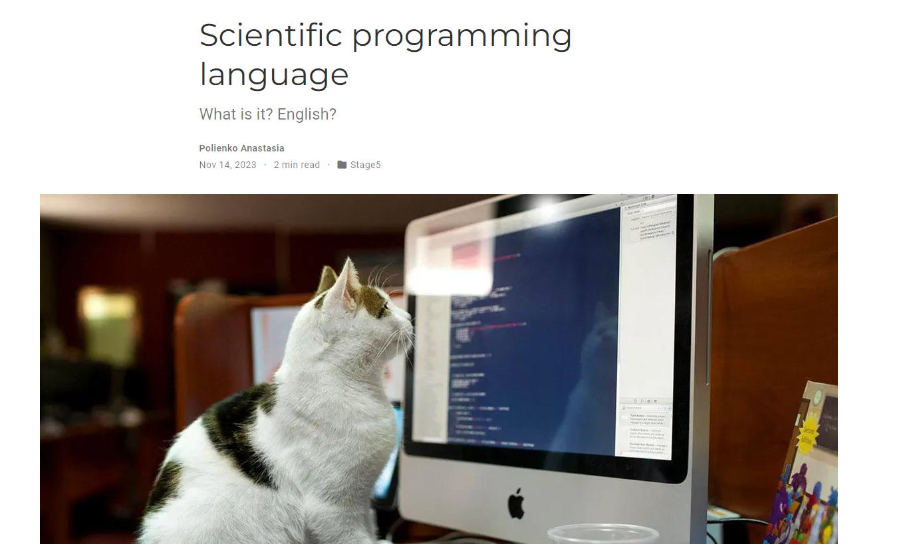

---
## Front matter
lang: ru-RU
title: Индивидуальный проект. Этап №5
subtitle: Научное программирование
author:
  - Полиенко Анастасия Николаевна
institute:
  - Российский университет дружбы народов, Москва, Россия
  - НПМмд-02-23
date: 20 сентября 2023

## i18n babel
babel-lang: russian
babel-otherlangs: english

## Fonts
mainfont: PT Serif
romanfont: PT Serif
sansfont: PT Sans
monofont: PT Mono
mainfontoptions: Ligatures=TeX
romanfontoptions: Ligatures=TeX
sansfontoptions: Ligatures=TeX,Scale=MatchLowercase
monofontoptions: Scale=MatchLowercase,Scale=0.9

## Formatting pdf
toc: false
toc-title: Содержание
slide_level: 2
aspectratio: 169
section-titles: true
theme: metropolis
header-includes:
 - \metroset{progressbar=frametitle,sectionpage=progressbar,numbering=fraction}
 - '\makeatletter'
 - '\beamer@ignorenonframefalse'
 - '\makeatother'
---

# Этап 5. Создание двуязычного сайта

## Цель работы

Создание персонального научного сайта-визитки на основе системы управления статическими сайтами.

## Задание

Добавить на сайт поддержку русского языка.

# Ход работы

## Добавление достижений

Для добавления языков редактируем файл *work/blog/config/defaul/lamguages.yaml*

## Основной контент

Обновляем основной контент - теперь можно переключить сайт на русскую версию

## Пост на русском

Добавляем посты -- теперь на двух языках

## Пост на английском

Добавляем посты -- теперь на двух языках

## Выводы

Провела второй этап подготовки к созданию персонального научного сайта-визитки на основе системы управления статическими сайтами.

